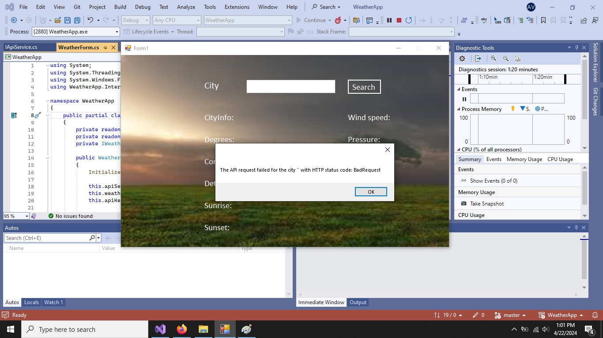
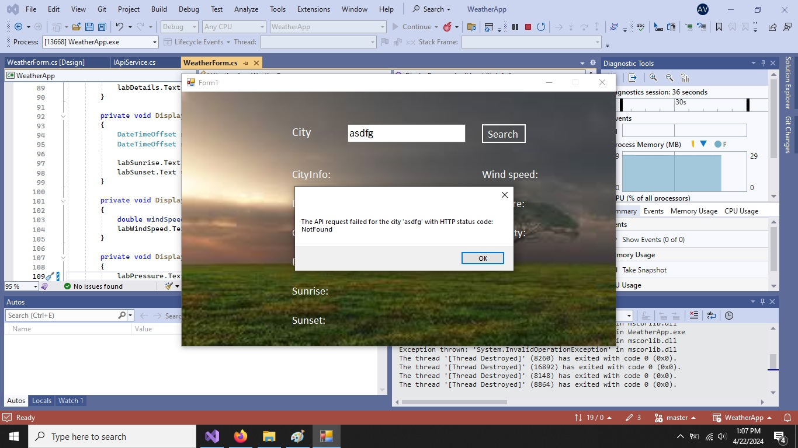

# WeatherApp

  WeatherApp is a small desktop application that provides weather information for a given location. This app uses the OpenWeatherMap API to retrieve current weather data and displays it in a simple and intuitive graphical interface

## Usage Instructions

  - Download and Installation: To use the application, download and install the WeatherApp.exe located in SetupInstaller folder

  - Launch Application: After installation, run the WeatherApp.exe file located in the bin directory's Debug folder
      
  - Enter Location: In the text field, enter the name of the city or location for which you want to retrieve weather information and press Search
    
  - View Weather Information: Temperature, weather conditions, wind, humidity, etc., will be displayed in the graphical interface

### Technologies and Tools Used

    - C#: The programming language used for developing the application
    
    - .NET Framework: The development platform for creating desktop applications
    
    - Windows Forms: The GUI library used for building the user interface
    
    - Newtonsoft.Json: The library used for serializing and deserializing JSON data
    
    - HttpClient: The .NET class used for making HTTP requests to the OpenWeatherMap API
    
    - Code Analyzers: Microsoft.CodeAnalysis.NetAnalyzers, Roslynator.Analyzers, SonarAnalyzer.CSharp

#### Screenshots

  - 
  - 
  - 
  - 

#### Documentation
  - https://openweathermap.org/
  - https://learn.microsoft.com/en-us/dotnet/csharp/asynchronous-programming/

  
