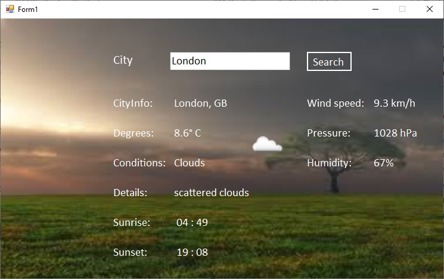

# WeatherApp

  WeatherApp is a small desktop application that provides weather information for a given location. This app uses the OpenWeatherMap API to retrieve current weather data and displays it in a simple and intuitive graphical interface

## Usage Instructions

  - Enter Location: In the text field, enter the name of the city or location for which you want to retrieve weather information and press Search

  - Please enter the name of the city in English, following the naming convention used by OpenWeatherMap. For example, for the capital of Romania, please enter "Bucharest" instead of "Bucuresti".

  - If you wish to find a city and it's important to specify the country it belongs to, you can add the country name or country code after the desired city. For example, enter "Paris, France" or 'Paris, FR'. This ensures you receive accurate weather information for the desired city
    
  - View Weather Information: Temperature, weather conditions, wind, humidity, etc., will be displayed in the graphical interface

### Technologies and Tools Used

    - C#: The programming language used for developing the application

    - .NET Framework: The development platform for creating desktop applications

    - Newtonsoft.Json: The library used for serializing and deserializing JSON data

    - System.IO: The namespace used for input and output operations

    - HttpClient: The .NET class used for making HTTP requests to the OpenWeatherMap API

    - Windows Forms: The GUI library used for building the user interface

    - System.Threading.Tasks: The namespace used for working with asynchronous tasks   
    
    - Code Analyzers: Microsoft.CodeAnalysis.NetAnalyzers, Roslynator.Analyzers, SonarAnalyzer.CSharp

#### Screenshots

  - 
  - 
  - 
  - 

#### Documentation
  - https://openweathermap.org/
  - https://learn.microsoft.com/en-us/dotnet/csharp/asynchronous-programming/

  
