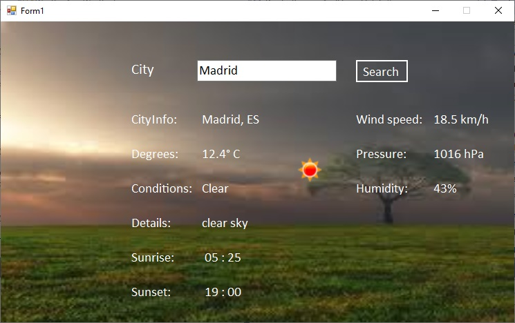

# WeatherApp

  WeatherApp is a small desktop application that provides weather information for a given location. This app uses the OpenWeatherMap API to retrieve current weather data and displays it in a simple and intuitive graphical interface

## Usage Instructions

  - **Enter Location**: In the text field, enter the name of the city or location for which you want to retrieve weather information and press Search

  - Please enter the **name** of the city in English, following the naming convention used by OpenWeatherMap. For example, for the capital of Romania, please enter "Bucharest" instead of "Bucuresti".

  - As multiple countries may have **cities** with the same name, it's important to specify the country when searching for a city with a common name to ensure accurate weather information. For example, enter "Sydney, Australia" or "Sydney, Canada". It works with country code (ISO 3166-1) too, "Sydeny, Au" or "Sydney, Ca"
    
  - **View Weather Information**: Temperature, weather conditions, wind, humidity, etc; will be displayed in the graphical interface

### Technologies and Tools Used

  - **C#**: The programming language used for developing the application

  - **.NET Framework**: The development platform for creating desktop applications

  - **Newtonsoft.Json**: The library used for serializing and deserializing JSON data

  - **System.IO**: The namespace used for input and output operations

  - **HttpClient**: The .NET class used for making HTTP requests to the OpenWeatherMap API

  - **Windows Forms**: The GUI library used for building the user interface

  - **System.Threading.Tasks**: The namespace used for working with asynchronous tasks

  - **XUnit**: A testing framework for .NET used to create unit tests.
    
  - **Code Analyzers**: Microsoft.CodeAnalysis.NetAnalyzers, Roslynator.Analyzers, SonarAnalyzer.CSharp

#### Screenshots

  - 
    
  - 

    For more screenshots, please visit [Screenshots](https://github.com/andreivarga36/WeatherApp/tree/master/ScreenShots)

#### Documentation

  - [OpenWeather](https://openweathermap.org/guide)
    
  - [Asynchronous Programming](https://learn.microsoft.com/en-us/dotnet/csharp/asynchronous-programming/)

  
